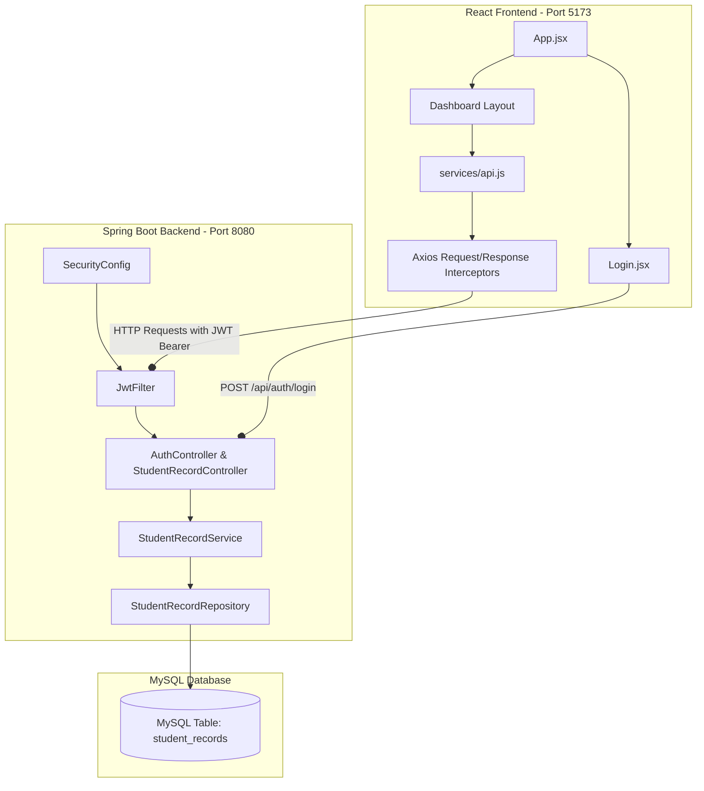
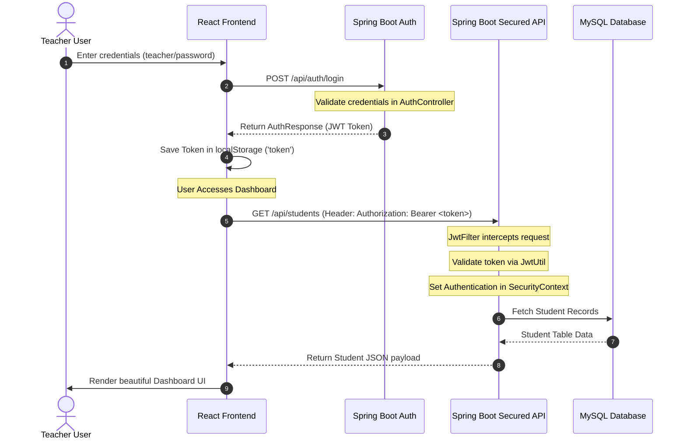

# 🎓 Student Upgrade Gradebook - Full-Stack JWT Security System

A modern, highly polished full-stack Student Management System built using a secure **Spring Boot** REST backend, a responsive **React (Vite)** frontend, and **MySQL** database storage. The system features a unified **JWT-based Security** pipeline with Spring Security stateless session management, a premium glassmorphic dark-mode interface, and real-time class grade statistics.

---

## 🏗️ Architectural Overview

The application follows a standard decoupled full-stack architecture. The React client communicates with the Spring Boot server through standard REST API endpoints. Database operations are handled using Spring Data JPA.



---

## 🔒 JWT Security Workflow

Below is the step-by-step workflow of the JWT Authentication cycle. The system utilizes stateless sessions; every protected HTTP request is intercepted and verified by the backend filter using a private cryptographic signature.



---

## 📁 Repository Folder Structure

```text
Student-Performance-Portal/
├── demo/                             # Backend Subsystem (Spring Boot)
│   ├── src/main/java/com/example/demo/
│   │   ├── auth/                     # Authentication controllers, request/response models
│   │   ├── config/                   # Spring Security configurations (CORS, Stateless, Filter Chain)
│   │   ├── controller/               # Secure Student records REST controllers
│   │   ├── entity/                   # JPA Entity definitions (StudentRecord mapped to DB table)
│   │   ├── exception/                # Global API exception handlers
│   │   ├── jwt/                      # JWT Token generation, validation, and Filter Interceptor
│   │   ├── repository/               # Spring Data JPA interface
│   │   └── service/                  # Business logic layers & database operations
│   ├── src/main/resources/           # Database setup and configurations (application.properties)
│   └── pom.xml                       # Maven dependency definitions (Spring Security, JJWT)
│
├── student-marks-frontend/           # Frontend Subsystem (React + Vite)
│   ├── src/
│   │   ├── assets/                   # SVG, fonts, and static assets
│   │   ├── components/               # High-fidelity dashboard, form, tables, and Login screen
│   │   │   ├── FilterBar.jsx         # Search and dynamic filtering layouts
│   │   │   ├── Login.jsx             # Premium glassmorphic login card
│   │   │   ├── StudentForm.jsx       # Inputs for record creation & editing
│   │   │   └── StudentTable.jsx      # Responsive gradebook data tables
│   │   ├── services/                 # Axios configurations & REST API integrations
│   │   │   └── api.js                # Global Axios request/response JWT interceptors
│   │   ├── App.css                   # Custom glassmorphic styling directives
│   │   ├── App.jsx                   # Central state controller & conditional layout routing
│   │   ├── index.css                 # Global styles, scrollbars, and color variables
│   │   └── main.jsx                  # React application entrypoint
│   ├── index.html                    # Root HTML layout and viewport setup
│   ├── package.json                  # Node packaging configurations
│   └── vite.config.js                # Development servers, proxies, and asset pipelines
└── README.md                         # This full-stack system documentation
```

---

## ⚡ Technical Highlights

### Backend (Spring Boot & Spring Security)
*   **Stateless Authentication**: Completely disables HTTP session state creation. All user contexts are derived cryptographically from each request's Bearer token.
*   **Token Interception Filter**: Custom `JwtFilter` parses `Authorization: Bearer <token>` headers, extracts usernames, checks expiration, and configures Spring's `SecurityContextHolder` with standard role-based (`ROLE_TEACHER`) access grants.
*   **Token Cryptography**: `JwtUtil` signs and verifies standard HMAC-SHA256 JWT tokens using a private 256-bit cryptographic signature key.
*   **Secure API endpoints**: Protects all endpoints (`/api/students/**`) while exposing authentication routing (`/api/auth/**`) for login.

### Frontend (React & Axios)
*   **Premium Dark UI**: Implements a glassmorphic aesthetic using standard CSS variables, Outfit typography, glowing outlines, responsive dashboard decks, and sliding alerts.
*   **Axios Request Interceptor**: Global HTTP middleware intercepts every outgoing endpoint query to append the authentication header dynamically.
*   **Axios Response Interceptor**: Monitors API responses. If an expiration or authentication failure occurs (`401 Unauthorized`), it automatically clears stored tokens and refreshes the application safely to redirect the user to login.
*   **Conditional Routes**: Prevents access to Dashboard components entirely if a valid token is missing, redirecting the viewport back to the login screen.
*   **Credentials Hints**: Renders copyable/selectable instructions so administrators and testers can easily evaluate features.

---

## 🚀 Setting Up the Application

### 📋 Prerequisites
*   **Java SE Development Kit (JDK)** version 17 or higher
*   **Maven** 3.x
*   **Node.js** version 18.x or higher
*   **MySQL Server** running locally or in a container

---

### 1. Database Setup
1.  Launch your MySQL terminal or database client.
2.  Create a schema named `student_db`:
    ```sql
    CREATE DATABASE student_db;
    ```
3.  Configure your local MySQL username and password in the backend configurations file: `demo/src/main/resources/application.properties`.
    ```properties
    spring.datasource.url=jdbc:mysql://localhost:3306/student_db?useSSL=false&serverTimezone=UTC
    spring.datasource.username=your_mysql_username
    spring.datasource.password=your_mysql_password
    ```

---

### 2. Run the Spring Boot Backend
1.  Navigate into the `demo` directory:
    ```bash
    cd demo
    ```
2.  Compile and boot the Spring Boot application using Maven:
    ```bash
    mvnw spring-boot:run
    ```
3.  The backend server will launch and listen for API queries on port `8080`.

---

### 3. Run the React Frontend
1.  Navigate into the `student-marks-frontend` directory:
    ```bash
    cd student-marks-frontend
    ```
2.  Install dependencies:
    ```bash
    npm install
    ```
3.  Boot the Vite development server:
    ```bash
    npm run dev
    ```
4.  Open your web browser and navigate to **[http://localhost:5173](http://localhost:5173/)** to access the Gradebook secure portal.

---

## 🔑 Login Credentials

For testing and verification, the backend includes pre-configured teacher portal credentials:
*   **Username**: `teacher`
*   **Password**: `password`
